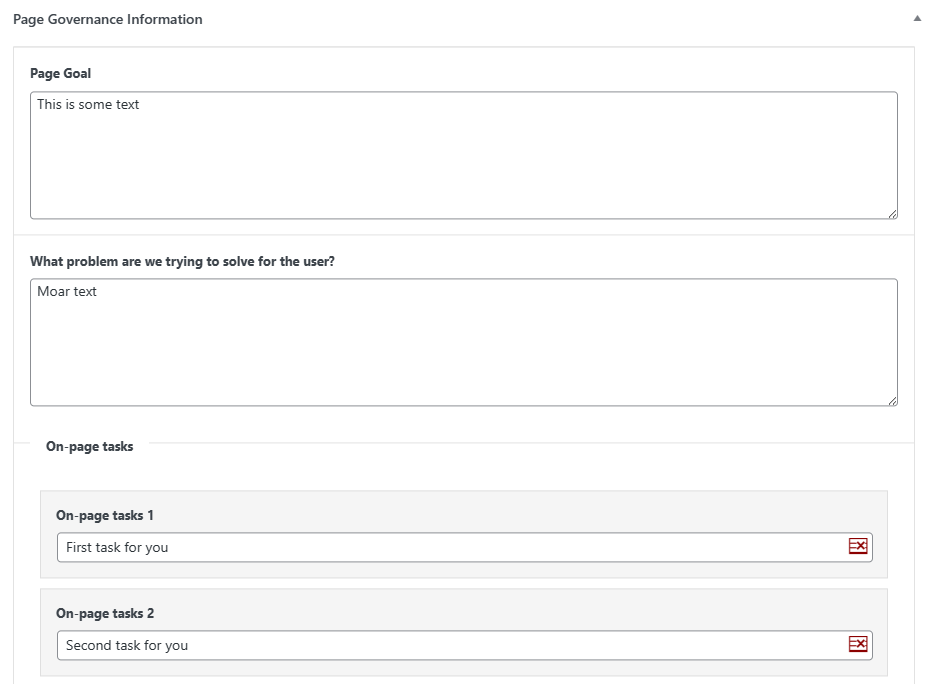
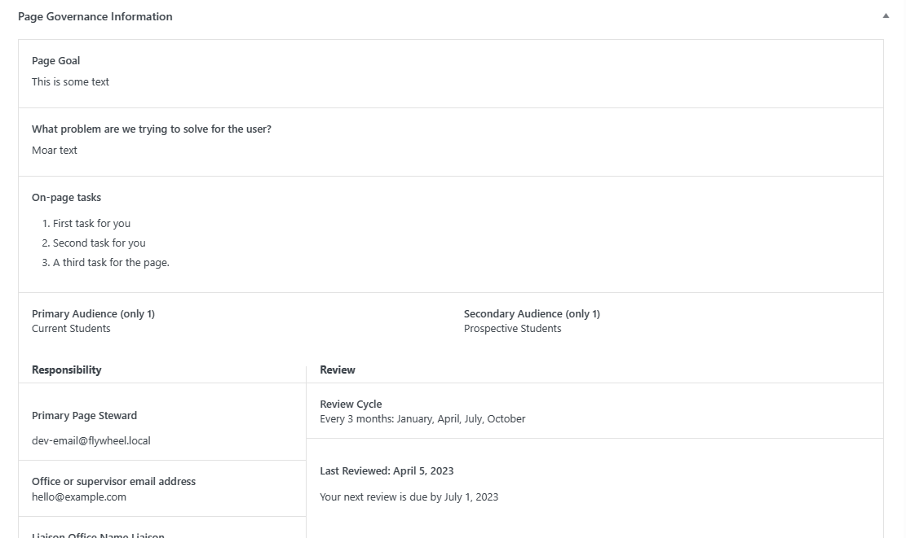
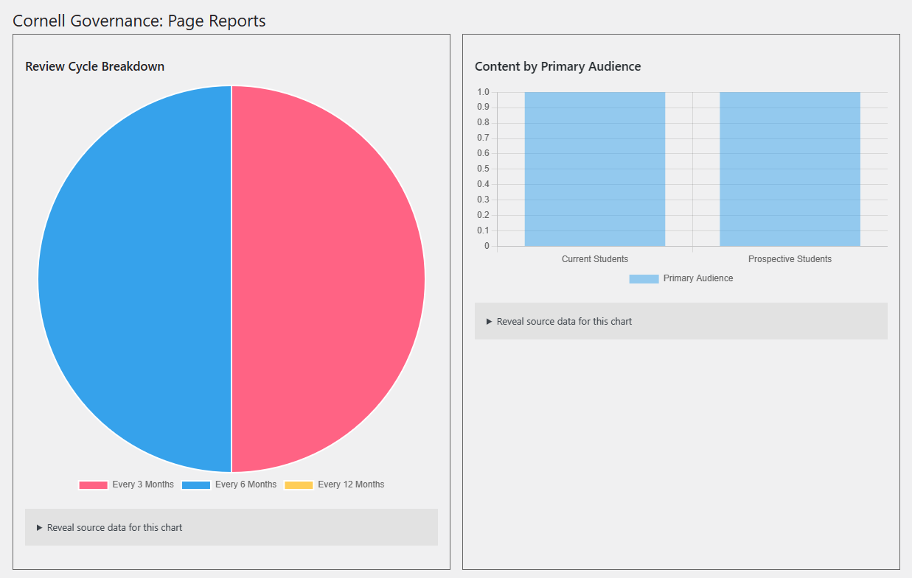
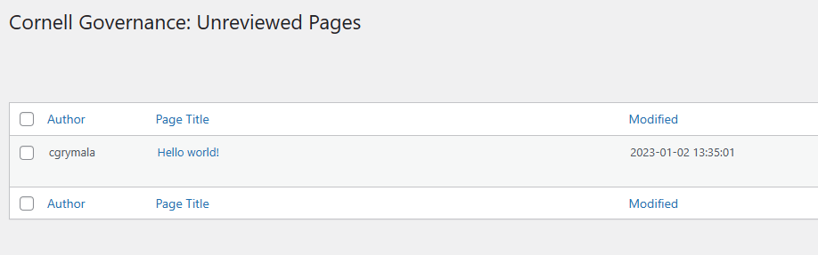
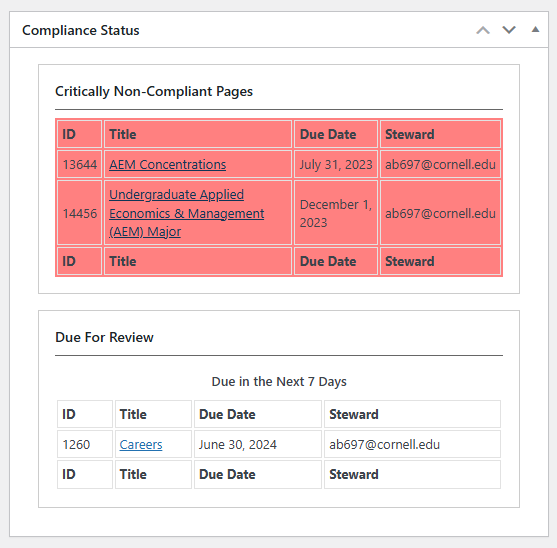

# Cornell In-Page Governance
**Contributors:** cgrymala  
**Donate link:** https://cornell.edu  
**Tags:** governance, notes, admin  
**Requires at least:** 6.4  
**Tested up to:** 6.5.3  
**Stable tag:** 0.4.6  
**Requires PHP:** 7.4  
**License:** GPLv2 or later  
**License URI:** https://www.gnu.org/licenses/gpl-2.0.html  

Allows tracking and adding notes about the content, purpose, audiences, etc of individual pages

## Description

This plugin adds numerous fields to the page editor, allowing users to review their pages, provide certain relevant information about the page and its audiences, etc.

It also adds automated review messages that can be emailed out to a list of relevant users.

### Setup

1. Go to Governance -> Audiences on each site and add the audiences that should be selectable for the Primary and Secondary Audience fields
1. Go to Governance -> Governance Settings on each site and make sure the settings make sense, then save them

### Settings

#### General Settings

1. **Which capability should be used to determine who can change governance information on a page?**  

    There are two interfaces for Governance information on individual pieces of content. The first interface is essentially a read-only interface, which displays the governance information about the page, provides a checkbox allowing the user to indicate that they have reviewed the governance information, and provides them with a link to request changes to that information. The second interface is the "administrative" interface, which allows privileged users to make changes to the governance information for that page. This setting allows you to specify which WordPress capability is used to determine whether to show the "read-only" interface or the fully interactive interface.

2. **What is the name of the office that manages Governance for your organization?** 

    In various places throughout the plugin, a managing office is referenced. To specify the name of that managing office, enter a value in this field. For instance, in one case, the name of that managing office might be "Marketing and Communications", so, one of the Governance information fields would read "Marketing and Communications Liaison", rather than just "Managing Office Liaison".

3. **On which post types should the governance information be displayed?** 

    This is a list of all post types registered on the site. Check off each post type where you would like the Governance metaboxes to appear.

4. **Global Tasks** 

    If you would like all authors to complete a specific set of on-page content review tasks on _all_ pages, in addition to the on-page content review tasks that are set for specific pages, this is where you will add them. 

    These global tasks will be inserted as plain-text above the list of inputs where administrators add new tasks for each page, and they will be inserted at the beginning of the task checklist for authors/page stewards.

#### Change Form Options

1. **Include a link to a form allowing users to request changes to the governance settings for a page?**
    
    Check this box to include a link to a "Change Form" that allows page authors and editors to request updates/changes to the governance settings for a specific piece of content.

    If this box is not checked, the rest of the Change Form settings are ignored, as no link is output in the Governance box.

2. **What text would you like to use for the "Change Form" link?**

    The text of the link to the change form is configurable; this is where you would specify exactly what you would like that link to say.

3. **What is the URL of the form that users can fill out to submit requests for changes?**

   A link to a "request" form is provided to non-privileged users, so that they can request changes to the governance information for a specific page. This field allows you to specify where that request form lives.

4. **Which properties of the post should be appended to the change form URL?**

   Once the URL for the change form is set, the plugin can automatically add a number of parameters to that URL, so that some information can be automatically included in the request. This field allows you to choose which information is automatically added as a query string to that URL:
    * `post_title` - the title of the post/page being edited
    * `post_id` - the WordPress ID of the post/page being edited
    * `post_url` - the permalink URL to the post/page being edited
    * `user_email` - the email address associated with the WordPress user making the request
    * `user_id` - the WordPress ID of the user account making the request
    * `user_display_name` - the display name associated with the WordPress user making the request

#### Email Settings

This plugin will automatically send out three (3) separate email prompts for each review. 

The first prompt lets folks know that their pages are ready to be reviewed. 

The second prompt lets folks know that they should review their pages if they haven't already done so. 

The third prompt lets them know that they are getting close to being out of compliance, and they absolutely need to review their pages to keep them compliant.

These settings allow you to schedule how many days before non-compliance each of those prompt messages should be sent.

By default, they are set to 60 days, 30 days and 15 days.

1. How many days before a review is due should the first prompt message be sent?
2. How many days before a review is due should the second prompt message be sent?
3. How many days before a review is due should the third and final prompt message be sent?

### Constants

There are 4 constants used within this plugin:

1. `CORNELL_DEBUG` - This will output informational debug content into the error log when it is defined as `true`
2. `CORNELL_GOVERNANCE_EMAIL_TO` - If the `CORNELL_DEBUG` constant is defined as `true` and this constant is defined with a valid email address, that email address will be used as the "to" field for all automated emails from this plugin (overriding the individual users' email addresses)
3. `CORNELL_GOVERNANCE_EMAIL_CC` - Can accept a comma-separated list of email addresses. Any addresses set inside this constant will receive a CC copy of all email messages sent by this plugin
4. `CORNELL_GOVERNANCE_EMAIL_BCC` - Can accept a comma-separated list of email addresses. Any addresses set inside this constant will receive a BCC copy of all email messages sent by this plugin

_In a multisite environment, these constants will impact all sites in the network where the plugin is active; they are not unique to each individual site within the network._

### Emails

This plugin can automatically dispatch email messages to authors/page stewards, supervisors/secondary contacts, and liaisons. 

By default, an email message will be sent to authors/page stewards 60 days before a page is due for review. 

Emails will also be sent to authors/page stewards and their supervisors/secondary contact 30 days before a page review is due.

Another email will be sent to authors/page stewards, their supervisors/secondary contacts, and the page liaisons 7 days before a page is due for review, and a final email will be sent to those same folks daily once a page is overdue.

You can change the "60 days", "30 days" and "7 days" to your own custom values within the plugin settings.

In order to automate the email sending, you will need to set up a cron job that adds `cornell/governance/run-email-cron` as part of the query string. We recommend, if possible, adding a unique value for that query parameter in order to ensure the request doesn't get cached by your server.

An example would be: `https://www.example.com/?cornell/governance/run-email-cron=2023-09-06-122500`

#### Email Templates

This plugin includes basic templates for all of the automated emails that it sends out.

If you would like to build custom templates, you can do so by including them in your WordPress theme. The file structure is as follows:

  - {theme directory}/cornell-governance/templates/
    - Compliant.handlebars
    - Due.handlebars
    - Initial_Prompt.handlebars
    - Overdue.handlebars
    - Secondary_Prompt.handlebars
    - Tertiary_Prompt.handlebars
    - Supervisor/
      - Due.handlebars
      - Overdue.handlebars
      - ~~Secondary_Prompt.handlebars~~
      - Tertiary_Prompt.handlebars
    - Liaison/
      - Due.handlebars
      - Overdue.handlebars
      - ~~Tertiary_Prompt.handlebars~~

The template files are built as [Handlebars templates](https://handlebarsjs.com/). The following data are available by default to the template files:

  - `site_name` - The title of the site (as set in Settings -> General in your WordPress site)
  - `managing-office` - The name of the managing office (default: "MarCom")
  - `review_time` - (Only available in the Initial, Secondary and Tertiary Prompt emails) - the number of days within which the review is due (by default, these are 60 days, 30 days and 7 days)
  - `report` - This is an object/array that contains all of the properties available in a standard [WP_Post object](https://developer.wordpress.org/reference/classes/wp_post/), in addition to the following:
    - `permalink` - The full URL to the piece of content
    - `due_date` - A formatted version of the date on which the review is due
    - `edit_link` - The full URL to edit the piece of content
    - `author_email` - The email address of the content author
  - `prompt-times` - The numerical representations of the number of days before due date that a prompt is sent
    - `initial` - The numerical representation of the first prompt (default: 60)
    - `secondary` - The numerical representation of the second prompt (default: 30)
    - `tertiary` - The numerical representation of the third prompt (default: 7)
  - `prompt-words` - A textual representation of the number of days before due date that a prompt is sent
    - `initial` - A textual representation of the first prompt (default: "sixty")
    - `secondary` - A textual representation of the second prompt (default: "thirty")
    - `tertiary` - A textual representation of the third prompt (default: "seven")
    - `initial-uc` - A textual representation of the first prompt with the first letter capitalized (default: "Sixty")
    - `secondary` - A textual representation of the second prompt with the first letter capitalized (default: "Thirty")
    - `tertiary` - A textual representation of the third prompt with the first letter capitalized (default: "Seven")

The template variables can be modified using the `cornell/governance/emails/report-data` filter. That filter sends the array of data being sent to the template as the first parameter, and the name of the PHP class being used to generate the email as the second parameter.

## Installation

1. Upload the plugin files to the `/wp-content/plugins/cornell-governance` directory, or install the plugin through the WordPress plugins screen directly.
2. Activate the plugin through the 'Plugins' screen in WordPress

## Frequently Asked Questions

### What filters are available in this plugin?

#### Settings

* `cornell/governance/capability` - filters the WordPress capability that determines whether a user is able to edit/manage the options and fields within this plugin.
* `cornell/governance/managing-office` - filters the name of the managing office that is in charge of reviewing the governance compliance.
* `cornell/governance/post-types` - filters the list of post types on which the governance information appears
* `cornell/governance/default-tasks` - filters the array of default tasks before they are added to the list on the page itself
* `cornell/governance/change-form/active` - filters whether the Change Form link should be displayed or not
* `cornell/governance/change-form/link-text` - filters the text that's used for the Change Form link
* `cornell/governance/change-form/url` - allows you to change the location of the form used for requesting changes
* `cornell/governance/change-form/props` - filters the array of query parameters appended to the change form URL when it's presented as a link (same as below)
* `cornell/governance/change-form-url/parameters` - filters the array of query parameters appended to the change form URL when it's presented as a link
* `cornell/governance/emails/limit` - allows you to limit how many emails are sent in a single batch. The default is 25.

#### Reports

_General_

* `cornell/governance/reports/current-user` - if a report should only show posts authored/owned by a specific user, use this filter to set that user ID

_Page List Report_

* `cornell/governance/page-list-table/columns` - filters the columns to be included in the WP_List_Table within the Page List report
* `cornell/governance/page-list-table/columns/visible` - filters which columns are visible in the Page List report
* `cornell/governance/page-list-table/columns/hidden` - filters which columns are hidden in the Page List Report
* `cornell/governance/page-list-table/columns/sortable` - filters which columns in the Page List report are sortable
* `cornell/governance/page-list-table/columns/default-orderby` - filters which column is the one used by default for sorting the information
* `cornell/governance/page-list-table/columns/query-args` - filters the query arguments that are used when querying posts for the Page List report
* `cornell/governance/page-list-table/data` - filters the data returned by the query to be displayed in the Page List report

_Unreviewed Pages Report_

* `cornell/governance/unreviewed-table/columns` - filters the columns to be included in the WP_List_Table within the Unreviewed Pages report
* `cornell/governance/unreviewed-table/columns/visible` - filters which columns are visible in the Unreviewed Pages report
* `cornell/governance/unreviewed-table/columns/hidden` - filters which columns are hidden in the Unreviewed Pages Report
* `cornell/governance/unreviewed-table/columns/sortable` - filters which columns in the Unreviewed Pages report are sortable
* `cornell/governance/unreviewed-table/columns/default-orderby` - filters which column is the one used by default for sorting the information
* `cornell/governance/unreviewed-table/columns/query-args` - filters the query arguments that are used when querying posts for the Unreviewed Pages report
* `cornell/governance/unreviewed-table/data` - filters the data returned by the query to be displayed in the Unreviewed Pages report

#### Email Templates

* `cornell/governance/emails/report-data` - filters the data shared with the email template. The first parameter is the array of report data. The second parameter is the name of the PHP class used to generate the email.

#### Miscellaneous

* `cornell/governance/textarea/value` - filters the value of a textarea field in meta boxes. The first parameter is the current value of the textarea; the second parameter is the HTML ID of the textarea field.

## Screenshots

1. [
    _A snapshot of the interface that a privileged user will see while editing a page_](assets/screenshot-1.png)
2. [
    _A snapshot of the interface a non-privileged user will see while editing a page_](assets/screenshot-2.png)
3. [
    _A snapshot of some of the basic reports that are available within the plugin_](assets/screenshot-3.png)
4. [
    _An example of the "Unreviewed Pages" report_](assets/screenshot-4.png)
5. [
    _An example of the Compliance Widget on the Dashboard for the current user_](assets/screenshot-5.png)

## Changelog

### 0.4.6

* Added `CORNELL_GOVERNANCE_EMAIL_CC` constant to allow users to force all messages to be CC'd to specific email addresses
* Added `CORNELL_GOVERNANCE_EMAIL_BCC` constant to allow users to force all messages to be BCC'd to specific email addresses

### 0.4.5

* Make default email templates more generic (removing any JCB-specific information)

### 0.4.4

* Implement email dispatches when a page is brought into compliance
    * Email message will be sent to page steward every time they complete a page review
    * Secondary contacts and liaisons will be CC’d on these messages when due date is within the next week (or already past)
* Add Site Name to all email subjects
* Re-enable the 7-day prompt to liaisons
* Change `Page Owner` to `Page Steward` in Secondary Prompt sent to Secondary Recipients

### 0.4.3

* Replace "Supervisor" with "Secondary Contact" in publicly-visible language
* Finish updating the Secondary Contact and Liaison email templates
* Remove secondary prompt from secondary contact list (they will only start receiving as of tertiary notice)
* Remove tertiary prompt from liaison contact list (they will only begin receiving as of "due today")

### 0.4.2

* Begin updating Web Steward email templates
* Implement Due Day email prompts

### 0.4.1

* Attempt to temporarily short-circuit all emails from prod/test/dev

### 0.4.0

* Re-implement different email schedules
* Fix email template-building
* Implement optional email debugging

### 0.3.9

* Stop page from loading when email cron task is triggered
* Force debug email address when appropriate
* Add debug information on cron task

### 0.3.8

* Removed extraneous report block

### 0.3.7

* Updated microcopy explaining how to save Governance Information for a page
* Attempt to fix email automation
* Fix subjects for prompt emails
* Add CSS to group Save Instructions together with Save button

### 0.3.6

* Fixes fatal error in some revisions

### 0.3.5

* Added message field above Save Governance Information button

### 0.3.4

* Fix fatal error in reports when date/time returns false
* Update access methods for email classes

### 0.3.3

* Began setting up email templates
* Fixed some uninitialized variables
* Set email headers to be merged, rather than overwritten

### 0.3.2

* Fixed the way commit messages were converted from the old format
* Ensured that commit messages are associated with the correct user

### 0.3.0

* Fixed commit messages being associated with multiple revisions (showing up as duplicate commits)
* Fixed time stamps on commit messages

### 2023-09

* Added automated email reports

### 2023-04

* Added reports and other functionality

### 2022-12

* This is the first version

* 2023-09 - Added automated email reports
* 2023-04 - Added reports and other functionality
* 2022-12 - This is the first version

## Upgrade Notice

* 0.4.6 - Added `CORNELL_GOVERNANCE_EMAIL_CC` and `CORNELL_GOVERNANCE_EMAIL_BCC` constants
* 0.4.5 - Make default email templates more generic
* 0.4.4 - Dispatches email message when page steward completes page review
* 0.4.3 - Updates the email templates to match the desired template designs
* 0.3.7 - Updates microcopy
* 0.3.6 - Fixes fatal error in some revisions
* 0.3.4 - Fixes fatal error on some page status lists
* 0.3.3 - Begins using email templates
* 0.3.2 - Fixes more issues with commit messages
* 0.3.0 - Fixes some issues with commit messages
* 2023-09 - This version implements automated email reports
* 2023-04 - Upgrade to get the newest features, including a host of useful reports
* 2022-12 - This is the first version