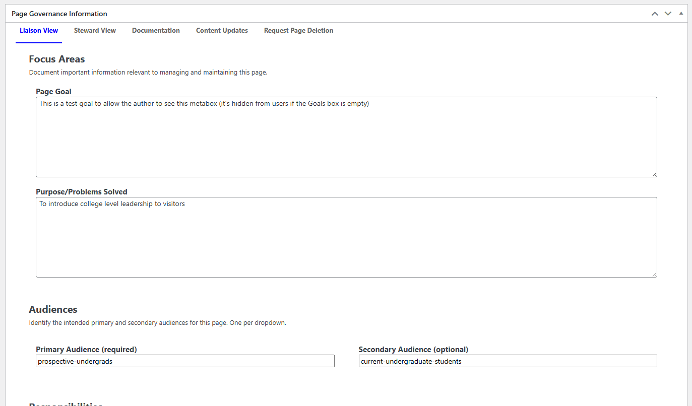
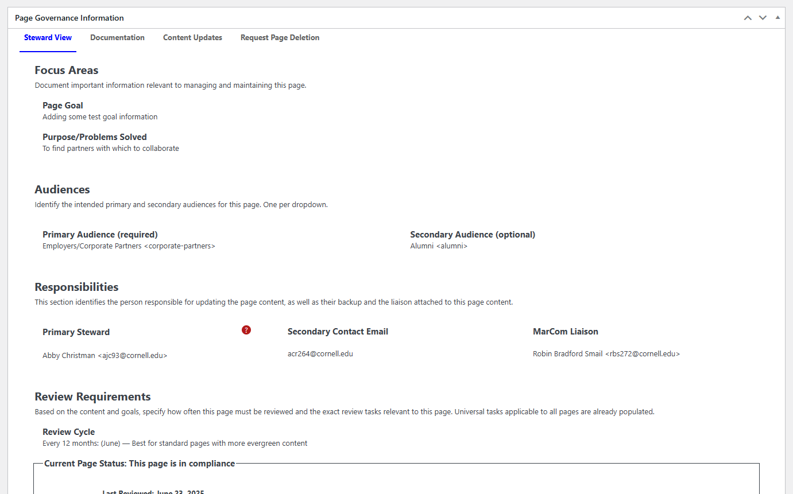
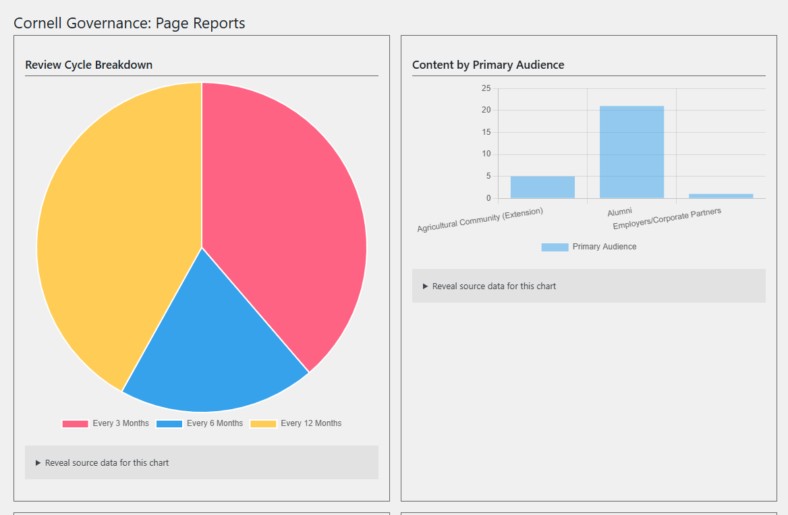
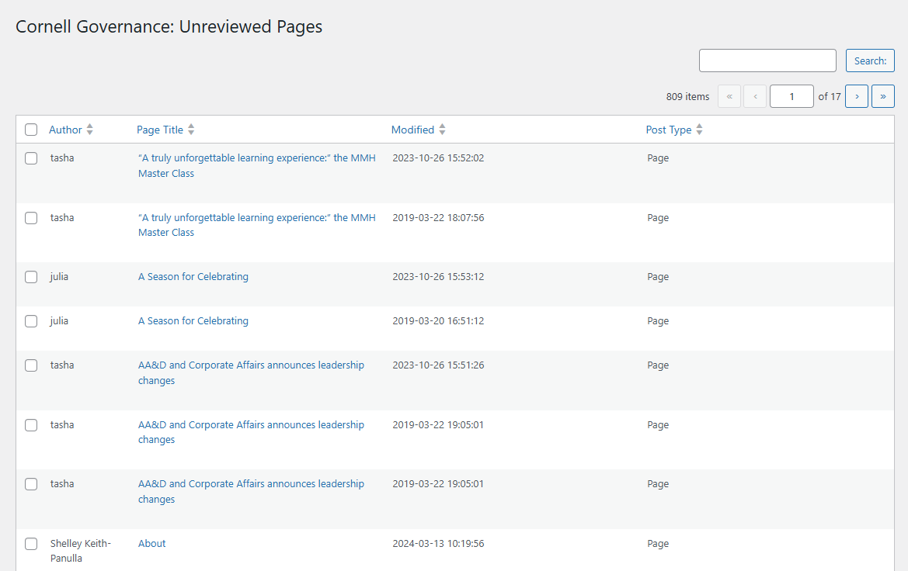
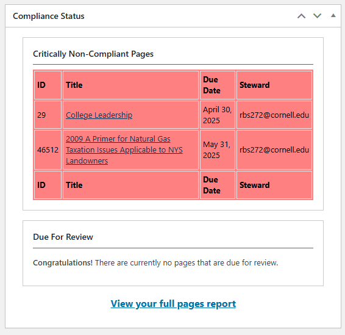
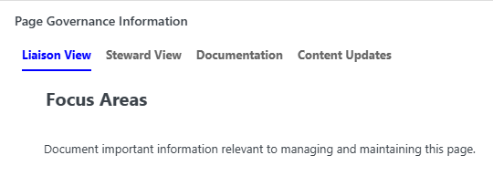
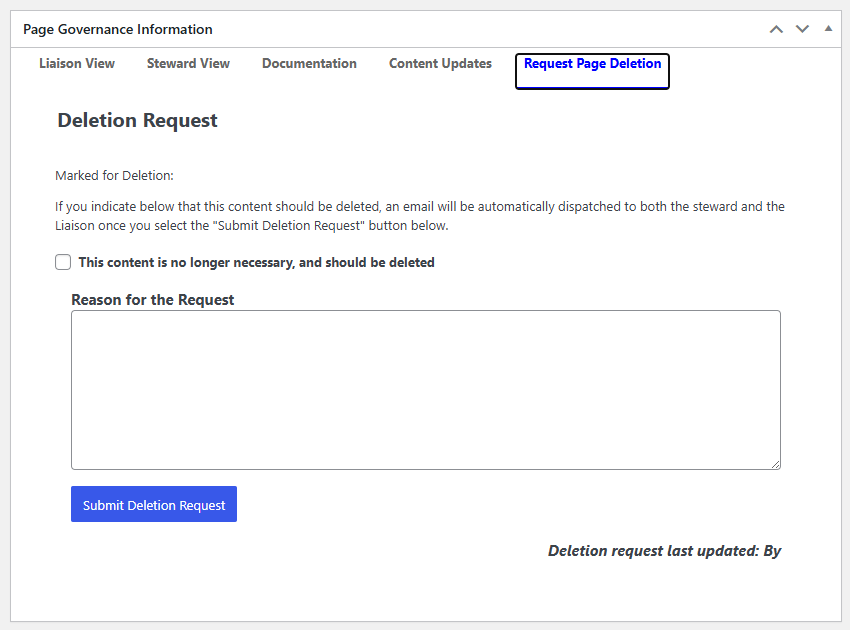
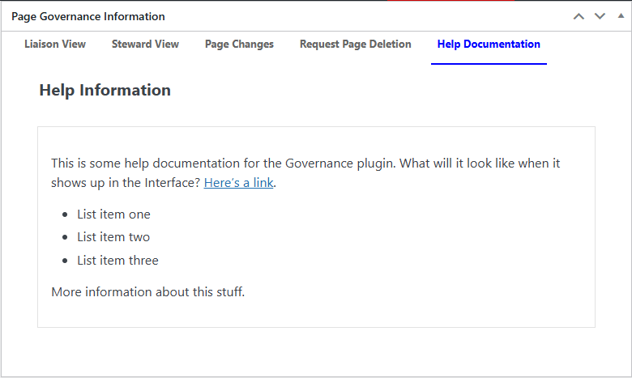
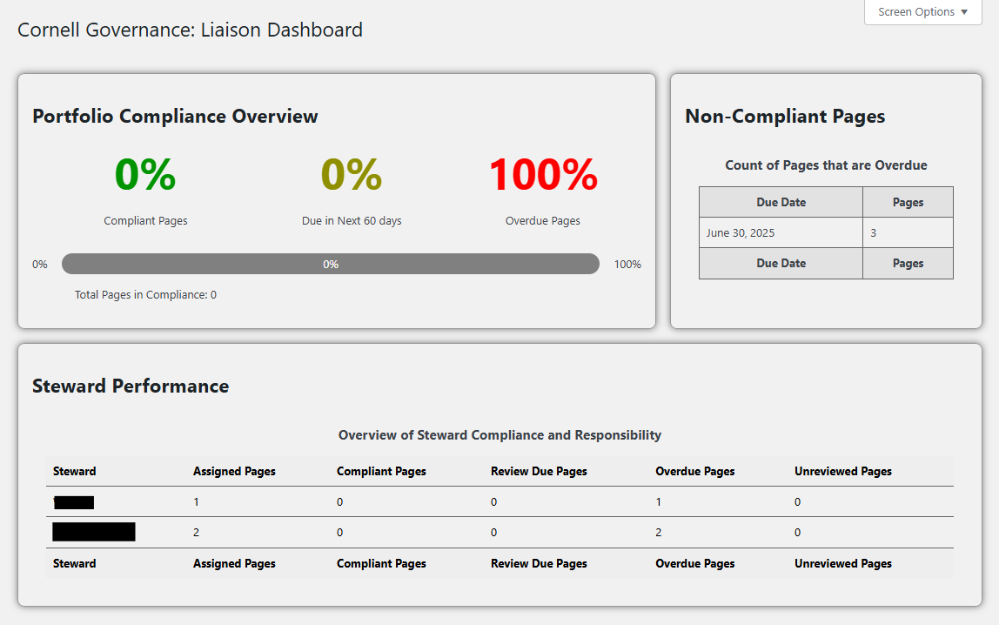

# Cornell In-Page Governance
Contributors: cgrymala  
Donate link: https://cornell.edu  
Tags: governance, notes, admin  
Requires at least: 6.4  
Tested up to: 6.7.1  
Stable tag: 1.0.3  
Requires PHP: 7.4  
License: GPLv2 or later  
License URI: https://www.gnu.org/licenses/gpl-2.0.html  

Allows tracking and adding notes about the content, purpose, audiences, etc of individual pages

## Description

This plugin adds numerous fields to the page editor, allowing users to review their pages, provide certain relevant information about the page and its audiences, etc.

It also adds automated review messages that can be emailed out to a list of relevant users.

### Links

1. [Setup](#setup)
2. [Updates](#updates)
3. [Settings](#settings)
    1. [General Settings](#general-settings)
    2. [Wayback Integration Settings](#wayback-integration-settings)
    3. [Change Form Settings](#change-form-settings)
    4. [Email Settings](#email-settings)
4. [Constants](#constants)
5. [Emails](#emails)
    1. [Email Templates](#email-templates)
6. [REST API Information](#rest-api-information)
    1. [WordPress Native REST Requests](#wordpress-native-rest-requests)
    2. [Custom Governance REST Endpoint](#custom-governance-rest-endpoint)
7. [Installation](#installation)
8. [Frequently Asked Questions](#frequently-asked-questions)
9. [Screenshots](#screenshots)
10. [Changelog](#changelog)
11. [Upgrade Notice](#upgrade-notice)

### Setup

1. Go to Governance -> Audiences on each site and add the audiences that should be selectable for the Primary and Secondary Audience fields
1. Go to Governance -> Governance Settings on each site and make sure the settings make sense, then save them

### Updates

The plugin has a built-in update checker. By default, it will use the public, authoritative GitHub repository for the plugin.

If you would like to override those settings to check your own Git repository, you can do so with environment variables or PHP constants.

To override those settings, you have a few options. 

1. You can copy the `.env.default` file to `.env` in the plugin folder, and update the definitions (**not recommended, as `.env` is a plain-text file, and those secrets would be publicly accessible**)
2. You can create and define environment variables on your server with these values
3. You can create a file called `cornell-governance-config.php` in the plugin's root and define these as PHP constants
4. You can add these constant definitions to your `wp-config.php` file

The definitions available are:

1. `CORNELL_GOVERNANCE_REPO_URL` - the URL to the Git repository
2. `CORNELL_GOVERNANCE_REPO_SLUG` - the unique slug for the repo; if you're using a self-hosted GitLab instance and subgroups or nested groups, you have to tell the update checker which parts of the URL are subgroups
3. `CORNELL_GOVERNANCE_REPO_BRANCH` - the name of the stable branch you want to use
4. If you are using a private Bitbucket repo, you will need to get a consumer key and secret, and define them:
    1. `CORNELL_GOVERNANCE_REPO_CONSUMER_KEY`
    2. `CORNELL_GOVERNANCE_REPO_CONSUMER_SECRET`
5. If you're using a private GitLab repo, you will need to get a token and define it:
    1. `CORNELL_GOVERNANCE_REPO_AUTH_TOKEN`
6. `CORNELL_GOVERNANCE_REPO_IS_CUSTOM_GITLAB` - If you're using a self-hosted GitLab repo, you need to indicate that by setting this to `true`  

### Settings

#### General Settings

1. **Which capability should be used to determine who can change governance information on a page?**  

    There are two interfaces for Governance information on individual pieces of content. The first interface is essentially a read-only interface, which displays the governance information about the page, provides a checkbox allowing the user to indicate that they have reviewed the governance information, and provides them with a link to request changes to that information. The second interface is the "administrative" interface, which allows privileged users to make changes to the governance information for that page. This setting allows you to specify which WordPress capability is used to determine whether to show the "read-only" interface or the fully interactive interface.

2. **What is the name of the office that manages Governance for your organization?** 

    In various places throughout the plugin, a managing office is referenced. To specify the name of that managing office, enter a value in this field. For instance, in one case, the name of that managing office might be "Marketing and Communications", so, one of the Governance information fields would read "Marketing and Communications Liaison", rather than just "Managing Office Liaison".

3. **On which post types should the governance information be displayed?** 

    This is a list of all post types registered on the site. Check off each post type where you would like the Governance metaboxes to appear.

4. **Global Tasks** 

    If you would like all authors to complete a specific set of on-page content review tasks on _all_ pages, in addition to the on-page content review tasks that are set for specific pages, this is where you will add them. 

    These global tasks will be inserted as plain-text above the list of inputs where administrators add new tasks for each page, and they will be inserted at the beginning of the task checklist for authors/page stewards.

5. **Include a button allowing stewards to mark pages for deletion?**

    If this is enabled, then a "Mark this page for deletion" option becomes available to stewards, allowing them to specify that a page is no longer necessary. 

    When that option is selected by the Steward, then an email message is dispatched to the steward, the secondary contact, and the liaison, notifying all of them that the page is no longer necessary. At that point, the liaison can choose to delete/draft/remove the page from the site.

#### Wayback Integration Settings

1. **Integrate Wayback Machine archival of modified content?**

    Check this box to implement integration with the Internet Archive Wayback Machine

2. **If you would like to replace this site's URL with a production URL, enter this site's URL here.**

    _If this is a non-production site, chances are fairly good that there won't be any existing snapshots of the pages on this site (and that you probably don't want to capture snapshots of this site)._

    _In this case, the plugin can programatically replace any calls to the Wayback API so that it queries the production URL instead of the non-production URL._

    This setting allows you to specify the URL of this non-production site that should be replaced during those API queries.

3. **If you would like to replace this site's URL with a production URL, enter that production URL here.**

   _If this is a non-production site, chances are fairly good that there won't be any existing snapshots of the pages on this site (and that you probably don't want to capture snapshots of this site)._

   _In this case, the plugin can programatically replace any calls to the Wayback API so that it queries the production URL instead of the non-production URL._

    This setting allows you to specify the URL of your production site, so that that URL will replace this site's URL in Wayback queries.

4. **How many days should be stored in the Archive Snapshot log?**

    This plugin will store a log of Wayback Machine snapshot requests that are triggered by the plugin. That log should be cleaned out regularly in order to avoid bloat in the database.

    With this setting, you can specify how long those logs should be kept. The default is 30 days, but you can set it to any number of days you want. 

    If you have a very active, large site, you may want to set it as low as 7 days; if you have a fairly small site that doesn't get updated extremely often, you could realistically set this to 365 days.

#### Change Form Settings

1. **Include a link to a form allowing users to request changes to the governance settings for a page?**
    
    Check this box to include a link to a "Change Form" that allows page authors and editors to request updates/changes to the governance settings for a specific piece of content.

    If this box is not checked, the rest of the Change Form settings are ignored, as no link is output in the Governance box.

2. **What text would you like to use for the "Change Form" link?**

    The text of the link to the change form is configurable; this is where you would specify exactly what you would like that link to say.

3. **What is the URL of the form that users can fill out to submit requests for changes?**

   A link to a "request" form is provided to non-privileged users, so that they can request changes to the governance information for a specific page. This field allows you to specify where that request form lives.

4. **Which properties of the post should be appended to the change form URL?**

   Once the URL for the change form is set, the plugin can automatically add a number of parameters to that URL, so that some information can be automatically included in the request. This field allows you to choose which information is automatically added as a query string to that URL:
    * `post_title` - the title of the post/page being edited
    * `post_id` - the WordPress ID of the post/page being edited
    * `post_url` - the permalink URL to the post/page being edited
    * `user_email` - the email address associated with the WordPress user making the request
    * `user_id` - the WordPress ID of the user account making the request
    * `user_display_name` - the display name associated with the WordPress user making the request

#### Email Settings

This plugin will automatically send out three (3) separate email prompts for each review. 

The first prompt lets folks know that their pages are ready to be reviewed. 

The second prompt lets folks know that they should review their pages if they haven't already done so. 

The third prompt lets them know that they are getting close to being out of compliance, and they absolutely need to review their pages to keep them compliant.

These settings allow you to schedule how many days before non-compliance each of those prompt messages should be sent.

By default, they are set to 60 days, 30 days and 15 days.

1. How many days before a review is due should the first prompt message be sent?
2. How many days before a review is due should the second prompt message be sent?
3. How many days before a review is due should the third and final prompt message be sent?

#### Help Documentation Settings

You can optionally add an extra tab to the Governance interface included on the page edit screen with your custom help information.

Simply add your Help content to the WYSIWYG editor in the Help Documentation Settings tab and save the Governance settings, then any information entered in that WYSIWYG field will appear in its own tab within the interface.

### Constants

There are a number of constants used within this plugin. They can be defined as environment variables within your PHP environment; they can be defined in an `.env` file in the root folder of this plugin (not recommended for publicly-accessible websites); they can be defined within wp-config, or they can be defined as PHP constants in a file called `cornell-governance-config.php`.  

1. `CORNELL_DEBUG` - This will output informational debug content into the error log when it is defined as `true`
2. `CORNELL_GOVERNANCE_EMAIL_TO` - If the `CORNELL_DEBUG` constant is defined as `true` and this constant is defined with a valid email address, that email address will be used as the "to" field for all automated emails from this plugin (overriding the individual users' email addresses)
3. `CORNELL_GOVERNANCE_EMAIL_CC` - Can accept a comma-separated list of email addresses. Any addresses set inside this constant will receive a CC copy of all email messages sent by this plugin
4. `CORNELL_GOVERNANCE_EMAIL_BCC` - Can accept a comma-separated list of email addresses. Any addresses set inside this constant will receive a BCC copy of all email messages sent by this plugin

The following constants apply to the auto-update functionality. They are defined with defaults that will point to the main public Github repo, but you can redefine them for your own private repo if you prefer:

1. `CORNELL_GOVERNANCE_REPO_URL` - the URL to the git repo where this plugin can be downloaded
2. `CORNELL_GOVERNANCE_REPO_SLUG` - the slug of the plugin within that repo
3. `CORNELL_GOVERNANCE_REPO_BRANCH` - the branch from which you want to pull the plugin
4. `CORNELL_GOVERNANCE_REPO_CONSUMER_KEY` - if you are using a private Bitbucket repo, you will need to define a consumer key
5. `CORNELL_GOVERNANCE_REPO_CONSUMER_SECRET` - if you are using a private Bitbucket repo, you will need to define a consumer secret
6. `CORNELL_GOVERNANCE_REPO_AUTH_TOKEN` - if you are using a private GitLab repo, you will need to set an authorization token
7. `CORNELL_GOVERNANCE_REPO_IS_CUSTOM_GITLAB` - if you are using a custom/self-hosted GitLab server, you need to indicate that

_In a multisite environment, these constants will impact all sites in the network where the plugin is active; they are not unique to each individual site within the network._

### Emails

This plugin can automatically dispatch email messages to authors/page stewards, supervisors/secondary contacts, and liaisons. 

By default, an email message will be sent to authors/page stewards 60 days before a page is due for review. 

Emails will also be sent to authors/page stewards and their supervisors/secondary contact 30 days before a page review is due.

Another email will be sent to authors/page stewards, their supervisors/secondary contacts, and the page liaisons 7 days before a page is due for review, and a final email will be sent to those same folks daily once a page is overdue.

You can change the "60 days", "30 days" and "7 days" to your own custom values within the plugin settings.

In order to automate the email sending, you will need to set up a cron job that adds `cornell/governance/run-email-cron` as part of the query string. We recommend, if possible, adding a unique value for that query parameter in order to ensure the request doesn't get cached by your server.

An example would be: `https://www.example.com/?cornell/governance/run-email-cron=2023-09-06-122500`

#### Email Templates

This plugin includes basic templates for all of the automated emails that it sends out.

If you would like to build custom templates, you can do so by including them in your WordPress theme. The file structure is as follows:

  - {theme directory}/cornell-governance/templates/
    - Compliant.handlebars
    - Deletion.handlebars
    - Due.handlebars
    - Initial_Prompt.handlebars
    - Overdue.handlebars
    - Secondary_Prompt.handlebars
    - Tertiary_Prompt.handlebars
    - Supervisor/
      - Due.handlebars
      - Overdue.handlebars
      - ~~Secondary_Prompt.handlebars~~
      - Tertiary_Prompt.handlebars
    - Liaison/
      - Due.handlebars
      - Overdue.handlebars
      - ~~Tertiary_Prompt.handlebars~~

The template files are built as [Handlebars templates](https://handlebarsjs.com/). The following data are available by default to the template files:

  - `site_name` - The title of the site (as set in Settings -> General in your WordPress site)
  - `managing-office` - The name of the managing office (default: "MarCom")
  - `review_time` - (Only available in the Initial, Secondary and Tertiary Prompt emails) - the number of days within which the review is due (by default, these are 60 days, 30 days and 7 days)
  - `report` - This is an object/array that contains all of the properties available in a standard [WP_Post object](https://developer.wordpress.org/reference/classes/wp_post/), in addition to the following:
    - `permalink` - The full URL to the piece of content
    - `due_date` - A formatted version of the date on which the review is due
    - `edit_link` - The full URL to edit the piece of content
    - `author_email` - The email address of the content author
  - `prompt-times` - The numerical representations of the number of days before due date that a prompt is sent
    - `initial` - The numerical representation of the first prompt (default: 60)
    - `secondary` - The numerical representation of the second prompt (default: 30)
    - `tertiary` - The numerical representation of the third prompt (default: 7)
  - `prompt-words` - A textual representation of the number of days before due date that a prompt is sent
    - `initial` - A textual representation of the first prompt (default: "sixty")
    - `secondary` - A textual representation of the second prompt (default: "thirty")
    - `tertiary` - A textual representation of the third prompt (default: "seven")
    - `initial-uc` - A textual representation of the first prompt with the first letter capitalized (default: "Sixty")
    - `secondary` - A textual representation of the second prompt with the first letter capitalized (default: "Thirty")
    - `tertiary` - A textual representation of the third prompt with the first letter capitalized (default: "Seven")

The template variables can be modified using the `cornell/governance/emails/report-data` filter. That filter sends the array of data being sent to the template as the first parameter, and the name of the PHP class being used to generate the email as the second parameter.

### REST API Information

#### WordPress Native REST Requests

This plugin adds some custom information to the standard post REST requests found at `wp-json/wp/v2/`. The following data are added to these responses:

  - `goal` - the "Page Goal" text
  - `purpose` - the "Purpose/Problems Solved" text
  - `primaryAudience` - the slug for the Primary Audience selection
  - `secondaryAudience` - the slug for the Secondary Audience selection
  - `secondaryContact` - the email address for the Secondary Contact 
  - `liaison` - the email address for the liaison
  - `cycle` - a text representation of how often the page is reviewed
  - `complianceStatus` - a message about the page's compliance status
  - `updateMessage` - the most recent "Content Update" commit message
    - `commit-message` - the text of the latest commit message
    - `editor` - the ID of the user that posted that commit message
    - `timestamp` - the UNIX timestamp showing when the commit message was saved

#### Custom Governance REST Endpoint

You can also access just the Governance information for content by using the custom REST endpoint located at `wp-json/cornell/governance/v1/information`.

If you want Governance Information about a specific piece of content, you can append the content ID to the end of that endpoint. 

The properties included in this response are:

  - `post-title` - The title assigned to the piece of content (for informational purposes)
  - `goals` - the text of the "Page Goals" field
  - `primary-audience` - A [WP_Term](https://developer.wordpress.org/reference/classes/wp_term/#comment-2653) object containing information about the selected Primary Audience
  - `problem` - the text of the "Purpose/Problems Solved" field
  - `review-cycle` - an array with information about the review cycle
    - `cycle` - the number of months between reviews
    - `text` - a text representation showing how often the page needs to be reviewed
  - `secondary-audience` - A [WP_Term](https://developer.wordpress.org/reference/classes/wp_term/#comment-2653) object containing information about the selected Secondary Audience
  - `secondary-contact` - the email address of the Secondary Contact
  - `tasks` - an array of the tasks for the content
  - `liaison` - the email address for the Liaison assigned to this content
  - `timestamp` - the date and time at which the governance information was last updated
  - `last-review` - an array of information about when the content was last reviewed
    - `timestamp` - the UNIX timestamp when the content was last reviewed
    - `date` - the ISO 8601 date formatted date and time when the content was last reviewed
  - `initial-setup` - an array with information about when the governance information was first set up
    - `timestamp` - the UNIX timestamp when the information was created
    - `date` - the ISO 8601 date formatted date and time when the information was created
    - `user` - an array with information about the user that set up the governance information
      - `id` - the user ID
      - `email` - the user's email address
    - `completed-tasks` - an array showing which tasks (if any) have been checked off
    - `compliance-status` - a text representation showing the compliance status for the page
    - `notes` - an array with information about notes that have been added to the page
      - `notes` - the raw markdown text of the notes
      - `timestamp` - a WP-formatted date and time showing when the notes were last updated
      - `rendered` - an HTML-formatted version of the notes
    - `revisions` - an array of revision content update notes. Each item inside the array is an array with the following properties
      - `revision-id` - the ID that WP assigned to the revision that is associated with the update message
      - `message` - the text of the update message
      - `author` - an array of information about the user that committed the update message
        - `id` - the WP User ID
        - `email` - the user's email address
      - `timestamp` - the UNIX timestamp of the update message
      - `date` - the WP-formatted date and time of the update message

## Installation

1. Upload the plugin files to the `/wp-content/plugins/cornell-governance` directory, or install the plugin through the WordPress plugins screen directly.
2. Activate the plugin through the 'Plugins' screen in WordPress

## Frequently Asked Questions

### What filters are available in this plugin?

#### Settings

* `cornell/governance/capability` - filters the WordPress capability that determines whether a user is able to edit/manage the options and fields within this plugin.
* `cornell/governance/managing-office` - filters the name of the managing office that is in charge of reviewing the governance compliance.
* `cornell/governance/post-types` - filters the list of post types on which the governance information appears
* `cornell/governance/default-tasks` - filters the array of default tasks before they are added to the list on the page itself
* `cornell/governance/change-form/active` - filters whether the Change Form link should be displayed or not
* `cornell/governance/change-form/link-text` - filters the text that's used for the Change Form link
* `cornell/governance/change-form/url` - allows you to change the location of the form used for requesting changes
* `cornell/governance/change-form/props` - filters the array of query parameters appended to the change form URL when it's presented as a link (same as below)
* `cornell/governance/change-form-url/parameters` - filters the array of query parameters appended to the change form URL when it's presented as a link
* `cornell/governance/mark-for-deletion/active` - whether the mark for deletion option should be enabled or not
* `cornell/governance/emails/limit` - allows you to limit how many emails are sent in a single batch. The default is 25.
* `cornell/governance/frontend-compliance/active` - filters whether the Frontend Compliance widget is active or not
* `cornell/governance/archive/active` - filters whether the Wayback Machine integration is active or not
* `cornell/governance/wayback/timeout` - allows you to filter how long the list of Wayback Machine snapshots are cached (default is 1 day) _(added in 0.6.2)_
* `cornell/governance/wayback/record-limit` - allows you to filter the maximum number of Wayback Machine results to display in a list or table (default is 20) _(added in 0.6.2)_

#### Reports

_General_

* `cornell/governance/reports/current-user` - if a report should only show posts authored/owned by a specific user, use this filter to set that user ID

_Page List Report_

* `cornell/governance/page-list-table/columns` - filters the columns to be included in the WP_List_Table within the Page List report
* `cornell/governance/page-list-table/columns/visible` - filters which columns are visible in the Page List report
* `cornell/governance/page-list-table/columns/hidden` - filters which columns are hidden in the Page List Report
* `cornell/governance/page-list-table/columns/sortable` - filters which columns in the Page List report are sortable
* `cornell/governance/page-list-table/columns/default-orderby` - filters which column is the one used by default for sorting the information
* `cornell/governance/page-list-table/columns/query-args` - filters the query arguments that are used when querying posts for the Page List report
* `cornell/governance/page-list-table/data` - filters the data returned by the query to be displayed in the Page List report

_Unreviewed Pages Report_

* `cornell/governance/unreviewed-table/columns` - filters the columns to be included in the WP_List_Table within the Unreviewed Pages report
* `cornell/governance/unreviewed-table/columns/visible` - filters which columns are visible in the Unreviewed Pages report
* `cornell/governance/unreviewed-table/columns/hidden` - filters which columns are hidden in the Unreviewed Pages Report
* `cornell/governance/unreviewed-table/columns/sortable` - filters which columns in the Unreviewed Pages report are sortable
* `cornell/governance/unreviewed-table/columns/default-orderby` - filters which column is the one used by default for sorting the information
* `cornell/governance/unreviewed-table/columns/query-args` - filters the query arguments that are used when querying posts for the Unreviewed Pages report
* `cornell/governance/unreviewed-table/data` - filters the data returned by the query to be displayed in the Unreviewed Pages report

#### Email Templates

* `cornell/governance/emails/report-data` - filters the data shared with the email template. The first parameter is the array of report data. The second parameter is the name of the PHP class used to generate the email.

#### Import/Export

* `cornell/governance/import-export/headers` - allows you to add extra headers to import/export (must be used in conjunction with `cornell/governance/import-export/data`)
* `cornell/governance/import-export/data` - allows you to add additional data (custom fields, taxonomies, etc.) to the import/export (must be used in conjunction with `cornell/governance/import-export/headers`)
* `cornell/governance/import-export/data-defaults` - allows you to filter the default meta data that should be used for any post where that data is not set
* `cornell/governance/import-export/sample-descriptions` - filters the descriptions of data fields (second row) in the sample format. It's a good idea to use this if you manipulate the headers
* `cornell/governance/import-export/sample-data` - filters the sample data included in the sample format (third row). It's a good idea to use this if you manipulate the headers

In addition, the following actions are run during import/export:

* `do_action( 'cornell/governance/import-export/before-import', $data, $headers )`
    @param array `$data` - the full set of data from the import file  
    @param array `$headers` - the array of headers from the import file (the first row)  

    Allows you to perform any actions that need to be done before the import is actually performed.

* `do_action( 'cornell/governance/import-export/before-post-import', $post, $row, $headers )`  
    @param \WP_Post `$post` - the post being imported  
    @param array `$row` - the information being imported for the current post  
    @param array `$headers` - the array of headers from the import file (the first row)  

    Allows you to perform any actions that need to be done before information is imported for a specific post

* `do_action( 'cornell/governance/import-export/after-post-import', $post, $row, $headers )`  
  @param \WP_Post `$post` - the post being imported  
  @param array `$row` - the information being imported for the current post  
  @param array `$headers` - the array of headers from the import file (the first row)

  Allows you to perform any actions that need to be done after information is imported for a specific post

* `do_action( 'cornell/governance/import-export/after-import', $data, $headers )`
  @param array `$data` - the full set of data from the import file  
  @param array `$headers` - the array of headers from the import file (the first row)

  Allows you to perform any actions that need to be done after the import is completed.

#### Miscellaneous

* `cornell/governance/textarea/value` - filters the value of a textarea field in meta boxes. The first parameter is the current value of the textarea; the second parameter is the HTML ID of the textarea field.

## Screenshots

1. [
    _A snapshot of the interface that a privileged user will see while editing a page_](assets/screenshot-1.png)
2. [
    _A snapshot of the interface a non-privileged user will see while editing a page_](assets/screenshot-2.png)
3. [
    _A snapshot of some of the basic reports that are available within the plugin_](assets/screenshot-3.png)
4. [
    _An example of the "Unreviewed Pages" report_](assets/screenshot-4.png)
5. [
    _An example of the Compliance Widget on the Dashboard for the current user_](assets/screenshot-5.png)
6. [
    _An example of the list of recent commit messages_](assets/screenshot-6.png)
7. [
    _The Page Deletion Request interface_](assets/screenshot-7.png)
8. [
    _An optional, customizable Help Documentation Tab_](assets/screenshot-8.png)
9. [
Some of the reports available in the Liaison Dashboard](assets/screenshot-9.png)

## Changelog

### 1.0.3

* Fixes tabbed interface on Governance Settings page
* Cleans up the way Archive snapshots are triggered & processed

### 1.0.2

* Updates Liaison Dashboard
* Updates Wayback Machine integration
* Fixes some PHP warnings
* Fixes incorrect Secondary Contact information in reports

### 1.0.1

* Fixes table search functionality on report pages
* Adds new actions and filters allowing imports and exports to be manipulated
* Adds export functionality to reports
* Adds Help Documentation tab to interface
* Combines the "Documentation" tab with the "Content Updates" tab into "Page Changes" tab
* Adds new Users API endpoint that is available to any authenticated user (for reporting purposes)

### 1.0.0

This is the first complete version of the plugin. All features intended to be included in the initial version have been added and tested.

### 0.9.1

* Fixed some PHP warnings throughout the plugin

### 0.6.6

* Added URL to exported data to help identify pages
* Added user email and username to exported data, and begin handling user email in imports

### 0.6.5

* Adds a report where Liaisons can see all pages for which they're responsible
* Re-implements the "Screen Options" for all reports with page list tables
* Fixes pagination for report page lists

### 0.6.4

* Fixes fatal error in some Governance REST requests
* On import, will blank out last review date if that cell is blank in the import file

### 0.6.3

Bugfixes:

* Pages that were compliant were showing "Never reviewed" as their status; this is fixed
* There were some new PHP errors/warnings introduced in 0.6.2; these are fixed
* Various admin style tweaks

### 0.6.2

* Implements REST API for Governance information
  * Governance info is added to posts/pages REST endpoint
  * New custom endpoint specifically for Governance info
* Implements Import/Export functionality
  * You can now export all existing Governance information to a CSV file
  * You can also import a specially-formatted CSV file into a site to add, update or overwrite Governance information on the site
* Moves Deletion Request to its own tab in the interface
  * Adds field to allow steward to add reason for deletion

### 0.6.1

* Fix "View more content updates" link in Content Updates side metabox

### 0.6.0

* Move i18n to correct hook
* Fix PHP warning on frontend
* Move Info Meta Box key to root constant
* Add schema to registered meta data

### 0.5.9

* Implements new optional front-end compliance banner for post authors

### 0.5.8

* Fixes bug that kept authors from seeing Task checkboxes
    * Any user that is allowed to edit a post can now review the governance info for that post

### 0.5.7

* Updated microcopy for Audience selectors
* Updated microcopy for Secondary Contact Email field
* Tweaked CSS for legends and labels in Governance input metaboxes
* Begin setting automatic updater to preserve .env file
* Fixed bugs when calculating review dates
    * "Every 6 Months" cycle was calculating the date incorrectly
    * On the calculated due date, the language said "was" due, even though it shouldn't be due until the end of the day; that language is fixed

### 0.5.6

Bug-fixes:

* Ensure compliance status is update in real time when review cycle is changed or page review is completed
* Ensure Steward View is visible for Liaisons, and make sure save button is included appropriately in the correct contexts 
* CSS changes to 'Overdue' widget in dashboard and reports

### 0.5.5

* Fixes bug that stopped Liaisons from seeing Steward Tab

### 0.5.4

* Fixes fatal error introduced in 0.5.3

### 0.5.3

* Moved update checker to its own class
* Allow users to override default update settings

### 0.5.2

* Implemented automatic plugin updates

### 0.5.1

* Implemented tabbed interface for Liaison, Steward, Documentation and Content Updates (revisions)
* Fixes:
  * If a page is due for review, the steward will get the checkbox list rather than a plain list after governance information is updated
  * Updating the list of tasks no longer un-sets the completed tasks

### 0.5.0

* Implemented view mode for Page Documentation so that folks don’t accidentally edit it
* Updated micro copy throughout plugin
* Updated styles for Liaison View and Steward View meta box content

### 0.4.9

New Features:

* Allow editors, etc. to see non-interactive governance information
* Make "Mark for deletion" checkbox optional, based on plugin settings

Fatal Error Fixes:

* Fix fatal error in Page Meta reports
* Fix fatal errors when specific governance info is not set for a page
* Fix fatal error that occurred when saving Settings without any Change Form parameters selected

JavaScript Fixes:

* Stop overlay from being added multiple times during save
* Ensure that the Steward review options are hidden appropriately after confirming page review
* Ensure task lists are updated appropriately when tasks are updated

### 0.4.8

New Features:

* Add tabbed interface allowing Liaisons to act as Stewards on their own pages
* Add checkbox allowing Steward to mark a page for deletion
    * Add email message and template for deletion notification

Bug fixes:

* Stop Stewards from being able to confirm page review unless they’ve checked off all page tasks
* Fix bug that allowed Editors to confirm page review even if they were not the Steward for the page
* Automatically refresh governance information when changes are made:
    * Refresh compliance date and icon when page is reviewed
    * Refresh task list for Steward role when tasks are added through the Liaison role

### 0.4.7

* Updated NPM packages to resolve security issues in dependent packages

### 0.4.6

* Added `CORNELL_GOVERNANCE_EMAIL_CC` constant to allow users to force all messages to be CC'd to specific email addresses
* Added `CORNELL_GOVERNANCE_EMAIL_BCC` constant to allow users to force all messages to be BCC'd to specific email addresses

### 0.4.5

* Make default email templates more generic (removing any JCB-specific information)

### 0.4.4

* Implement email dispatches when a page is brought into compliance
    * Email message will be sent to page steward every time they complete a page review
    * Secondary contacts and liaisons will be CC’d on these messages when due date is within the next week (or already past)
* Add Site Name to all email subjects
* Re-enable the 7-day prompt to liaisons
* Change `Page Owner` to `Page Steward` in Secondary Prompt sent to Secondary Recipients

### 0.4.3

* Replace "Supervisor" with "Secondary Contact" in publicly-visible language
* Finish updating the Secondary Contact and Liaison email templates
* Remove secondary prompt from secondary contact list (they will only start receiving as of tertiary notice)
* Remove tertiary prompt from liaison contact list (they will only begin receiving as of "due today")

### 0.4.2

* Begin updating Web Steward email templates
* Implement Due Day email prompts

### 0.4.1

* Attempt to temporarily short-circuit all emails from prod/test/dev

### 0.4.0

* Re-implement different email schedules
* Fix email template-building
* Implement optional email debugging

### 0.3.9

* Stop page from loading when email cron task is triggered
* Force debug email address when appropriate
* Add debug information on cron task

### 0.3.8

* Removed extraneous report block

### 0.3.7

* Updated microcopy explaining how to save Governance Information for a page
* Attempt to fix email automation
* Fix subjects for prompt emails
* Add CSS to group Save Instructions together with Save button

### 0.3.6

* Fixes fatal error in some revisions

### 0.3.5

* Added message field above Save Governance Information button

### 0.3.4

* Fix fatal error in reports when date/time returns false
* Update access methods for email classes

### 0.3.3

* Began setting up email templates
* Fixed some uninitialized variables
* Set email headers to be merged, rather than overwritten

### 0.3.2

* Fixed the way commit messages were converted from the old format
* Ensured that commit messages are associated with the correct user

### 0.3.0

* Fixed commit messages being associated with multiple revisions (showing up as duplicate commits)
* Fixed time stamps on commit messages

### 2023-09

* Added automated email reports

### 2023-04

* Added reports and other functionality

### 2022-12

* This is the first version

* 2023-09 - Added automated email reports
* 2023-04 - Added reports and other functionality
* 2022-12 - This is the first version

## Upgrade Notice

### 1.0.3

Fixes: Governance settings work properly again

### 1.0.2

Improvements: Liaison dashboard and Wayback Machine integration

### 1.0.1

Feature: Adds new Help Documentation tab, as well as some extensibility

### 0.6.5

Feature: Adds a report where Liaisons can see all pages for which they're responsible

### 0.6.4

Bugfix: Should fix fatal error on REST requests

### 0.6.3

Bugfix: Pages that are compliant were showing "Never reviewed" as their status; this is fixed

### 0.6.2

Implements REST API endpoints, implements basic Wayback Machine integration, moves Deletion Request to its own tab, and adds new Import/Export functionality

### 0.6.1

Fixes "View more content updates" link in Content Updates side metabox

### 0.6.0

Minor bug fixes; mostly PHP warnings

### 0.5.8

Fixes bug that kept authors from being able to see task checkboxes

### 0.5.7

Microcopy and style tweaks

### 0.5.6

Compliance status is now updated in real-time when review cycle is changed of page review is completed

### 0.5.5

Fixes bug that stopped Liaisons from seeing Steward Tab

### 0.5.4

Fixes fatal error introduced in 0.5.3

### 0.5.3

Allow user to override update check defaults

### 0.5.2

Implemented automatic plugin updates

### 0.5.1

Implements tabbed interface for all governance information

### 0.5.0

Updated micro copy and styles for admin meta boxes

### 0.4.9

Minor JavaScript bug fixes; fatal error fixes

### 0.4.8

Fixes multiple bugs; allows Liaisons to review their own pages

### 0.4.7

Fixes NPM security vulnerabilities

### Older Versions

* 0.4.6 - Added `CORNELL_GOVERNANCE_EMAIL_CC` and `CORNELL_GOVERNANCE_EMAIL_BCC` constants
* 0.4.5 - Make default email templates more generic
* 0.4.4 - Dispatches email message when page steward completes page review
* 0.4.3 - Updates the email templates to match the desired template designs
* 0.3.7 - Updates microcopy
* 0.3.6 - Fixes fatal error in some revisions
* 0.3.4 - Fixes fatal error on some page status lists
* 0.3.3 - Begins using email templates
* 0.3.2 - Fixes more issues with commit messages
* 0.3.0 - Fixes some issues with commit messages
* 2023-09 - This version implements automated email reports
* 2023-04 - Upgrade to get the newest features, including a host of useful reports
* 2022-12 - This is the first version